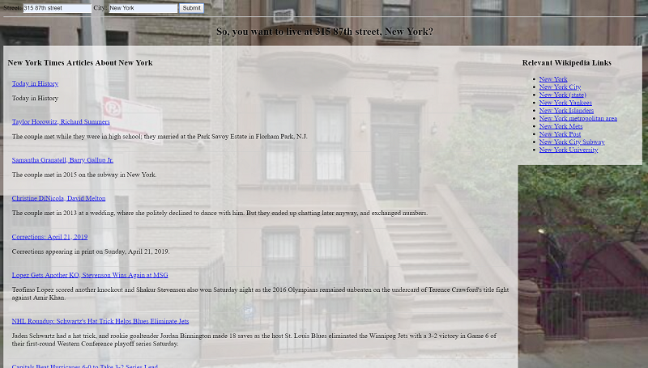

# Moving Planer

> Tool that helps the user to know more about some place

A web application that, after the user enters the address, shows an image of the location in its background. And, with the help of APIS from the New York Times and Wikipedia, it brings information about the city and its latest news. For this program I have used HTML, CSS and JavaScript skills, as well as knowledge of the Google StreetView, New York Times and Wikipedia APIs.

## Development setup

1. Make your API Key for Google and New York Times API and replace on code.

2. [GOOGLE DEVELOPERS](https://developers.google.com/maps/documentation/embed/get-api-key)

3. [NEW YORK TIMES DEV PAGE](https://developer.nytimes.com/get-started)

4. Replace here:

For Google Street View API
`var streetViewUrl = 'https://maps.googleapis.com/maps/api/streetview?size=600x400&location=' + address + '&key=USE_YOUR_API_KEY_HERE';`

For New York Times API
`var urlNYT = "https://api.nytimes.com/svc/search/v2/articlesearch.json?q=" + cityVal +"&sort=newest&api-key=USE_YOUR_API_KEY_HERE";`

## Running the program

1. Run index.html in your browser

## Usage example

When you fill the fields the app shows a Google Street View picture of the address, New York Times most recent articles about the place and city page on Wikipedia.

## Release History

* 0.0.2
   * README file updated
* 0.0.1
   * First version

## Meta
This program is heavily inspired by [Udacity class exercise](https://www.udacity.com/course/intro-to-backend--ud171)

Pedro Carvalho – [@PedrArch](https://twitter.com/PedroArch) – pedrofrancocarvalho@gmail.com

Distributed under the MIT license. See [LICENSE](LICENSE.txt) for more information.

[https://github.com/PedroArch](https://github.com/PedroArch/)

## Contributing

1. Fork it (<https://github.com/PedroArch/market-list/fork>)
2. Create your feature branch (`git checkout -b feature/fooBar`)
3. Commit your changes (`git commit -am 'Add some fooBar'`)
4. Push to the branch (`git push origin feature/fooBar`)
5. Create a new Pull Request

<!-- Markdown link & img dfn's -->
[twitter]:https://twitter.com/PedroArch
[github]:https://github.com/PedroArch
[email]: pedrofrancocarvalho@gmail.com
